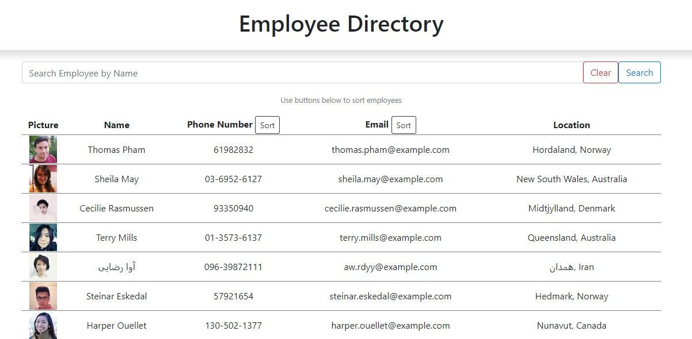

#  HW 19 - React Employee Directory 

## Description

This application uses react to create and display a dynamic and interactive employee directory where uses can interact with and update individual components of the site directly such as displaying searched employees, and re-sorting the employee list by phone number or email.

## Installation

* Navigate to https://github.com/mpkahn/employee_directory and clone repository to local machine.

* To run locally: 
* Install npm (`npm i`). 
* Install any other necessary modules (npm install bootstrap --save | npm install axios --save)
* Once NPM is installed, run "npm start" to launch application and go to localhost/3000 in browser

## Usage 

* App hosted at https://shielded-ocean-89798.herokuapp.com/

* On site, view list of employees:

* Type in employee name + hit "search" to search employees with that name
* Hit "clear" to restore main employee list
* Click "sort" next to Phone number or Email address to sort alphabetically (special characters -> numbers -> letters)
* Click "clear" again to restore original list

## Credits

* node.js and its documentation https://nodejs.org/api/fs.html 
* React https://reactjs.org/
* Bootstrap https://getbootstrap.com/
* Axios https://www.npmjs.com/package/axios
* Heroku

## License

MIT License

Copyright (c) [2021] [Michael Kahn]

Permission is hereby granted, free of charge, to any person obtaining a copy
of this software and associated documentation files (the "Software"), to deal
in the Software without restriction, including without limitation the rights
to use, copy, modify, merge, publish, distribute, sublicense, and/or sell
copies of the Software, and to permit persons to whom the Software is
furnished to do so, subject to the following conditions:

The above copyright notice and this permission notice shall be included in all
copies or substantial portions of the Software.

THE SOFTWARE IS PROVIDED "AS IS", WITHOUT WARRANTY OF ANY KIND, EXPRESS OR
IMPLIED, INCLUDING BUT NOT LIMITED TO THE WARRANTIES OF MERCHANTABILITY,
FITNESS FOR A PARTICULAR PURPOSE AND NONINFRINGEMENT. IN NO EVENT SHALL THE
AUTHORS OR COPYRIGHT HOLDERS BE LIABLE FOR ANY CLAIM, DAMAGES OR OTHER
LIABILITY, WHETHER IN AN ACTION OF CONTRACT, TORT OR OTHERWISE, ARISING FROM,
OUT OF OR IN CONNECTION WITH THE SOFTWARE OR THE USE OR OTHER DEALINGS IN THE
SOFTWARE.

